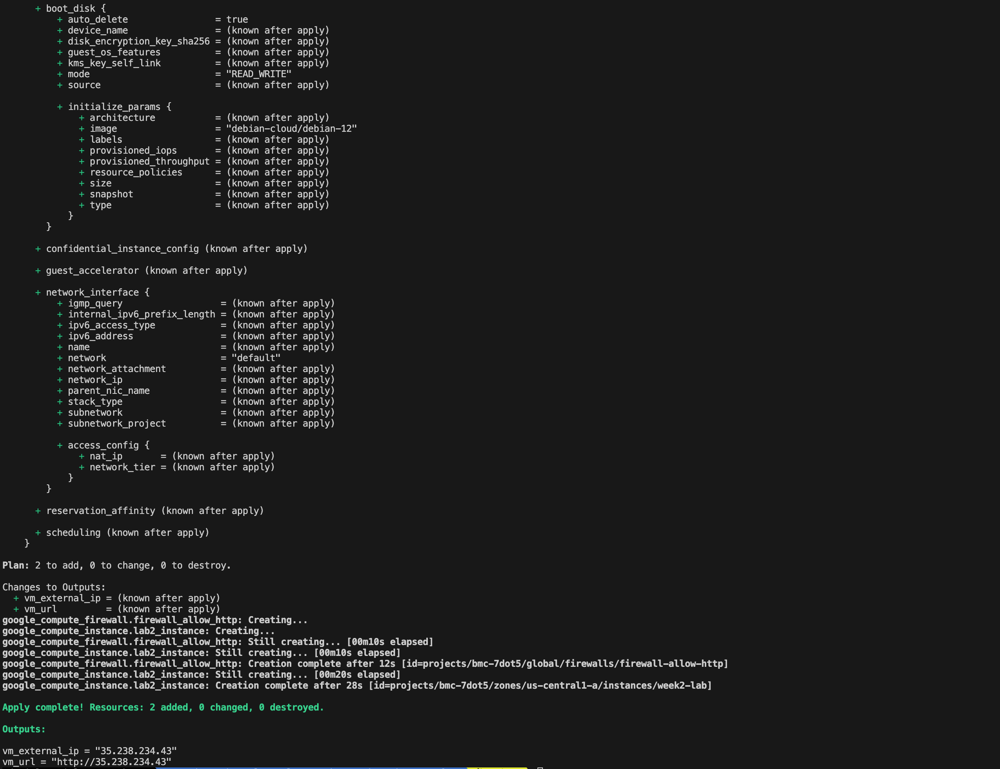
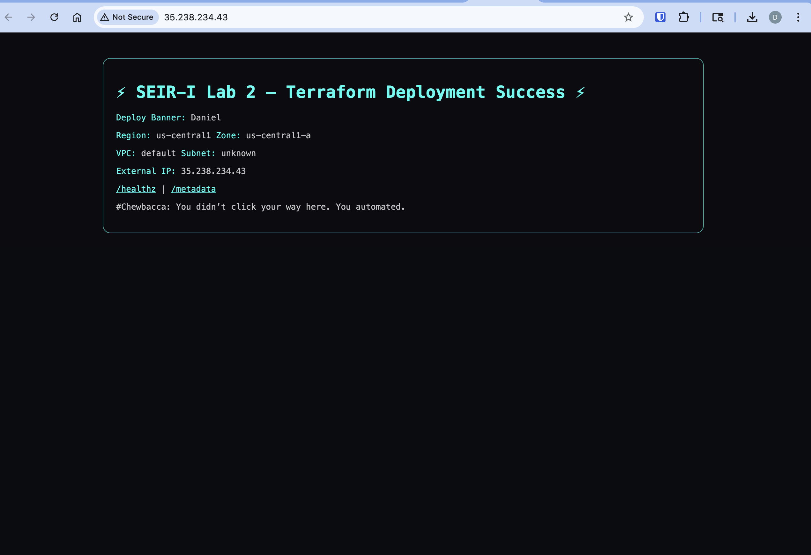

---
tags:
  - BMC
  - GCP
  - homework
name: Homework Week 3
week: "3"
---

# Overview

- Homework assignment overview can be found [here](https://github.com/BalericaAI/SEIR-1/blob/main/homework.md).

# Commands

```bash
terraform init
terraform validate
terraform plan -out tfplan
terraform apply tfplan

terraform output vm_url

VM_IP=${terraform output -raw vm_external_ip}
VM_IP="$VM_IP" ./gate_lab2_http.sh
```

# Deliverables

- [x] terraform plan output saved as [plan.txt](./plan.txt)
- [x] terraform apply proof 
- [x] vm url: http://35.238.234.43// 
- [x] [Gate Result](./gate_result.json)
- [x] [Badge](./badge.txt)

## Udemy

**_GCP MasterClass Section 10_**


**_Google Professional Cloud Security Enginer Section 13_**

