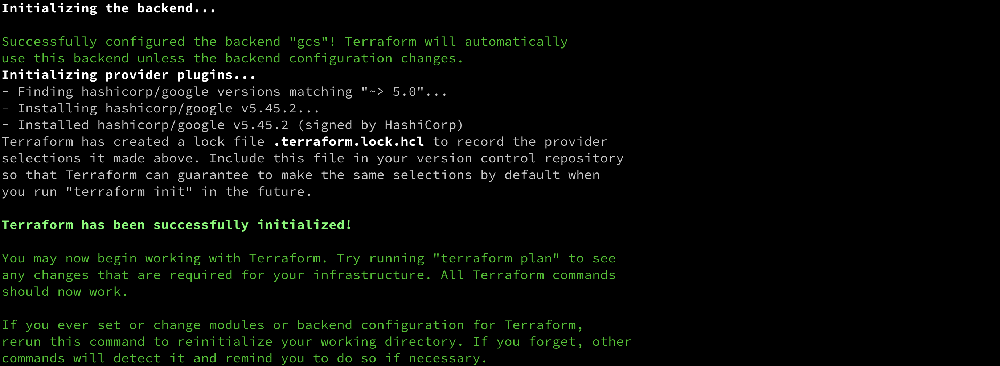
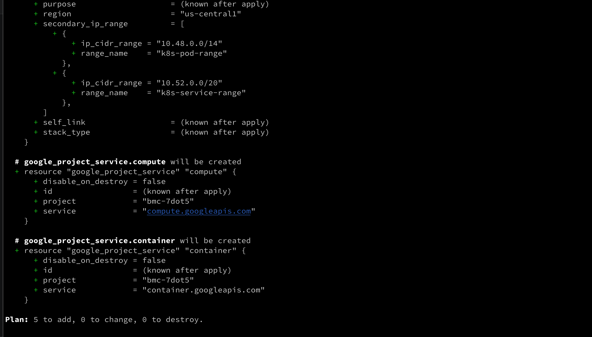
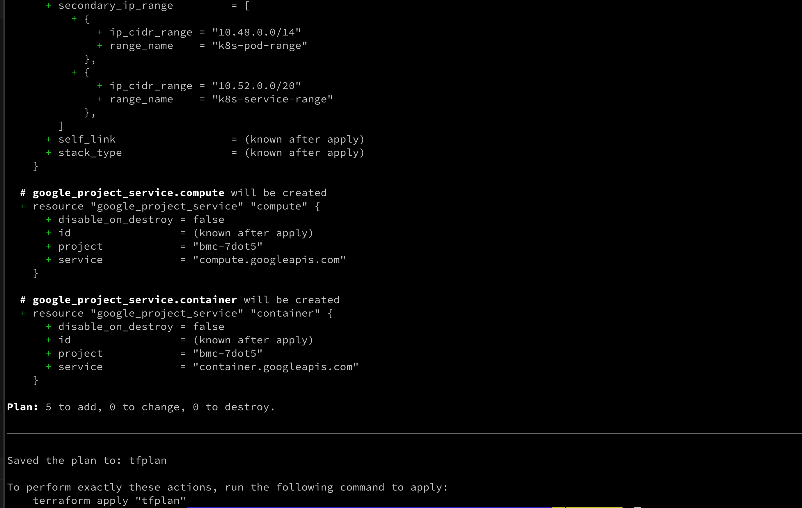
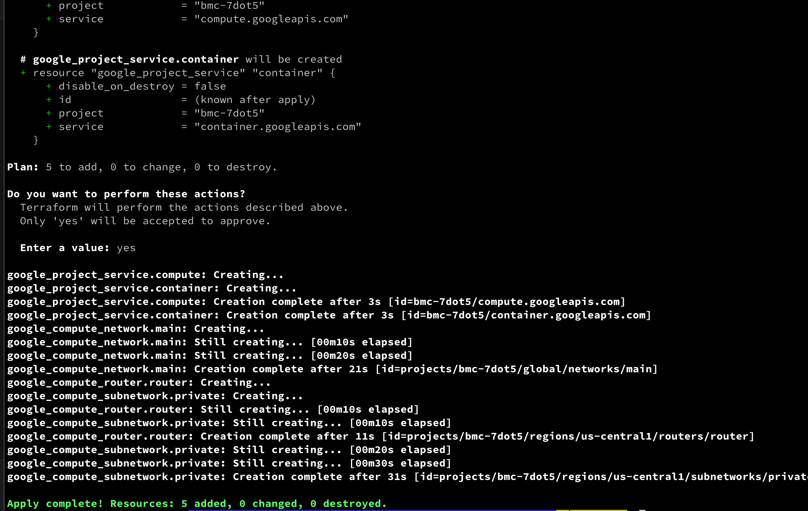
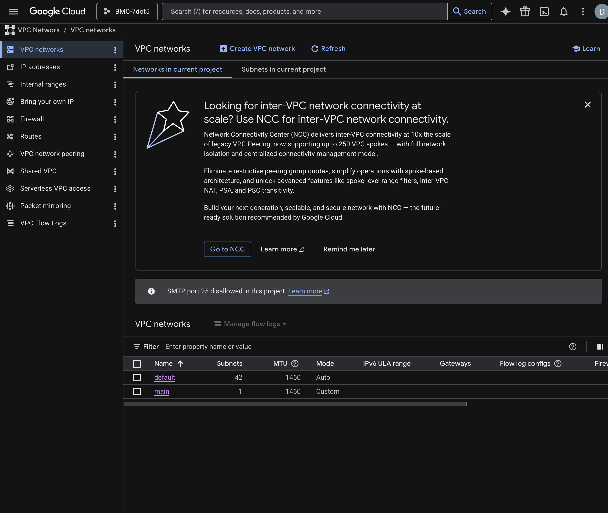
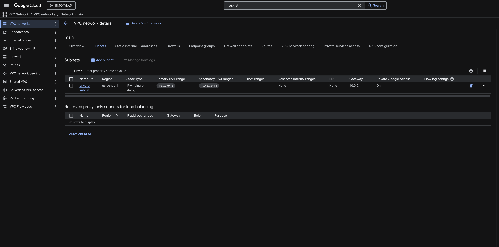
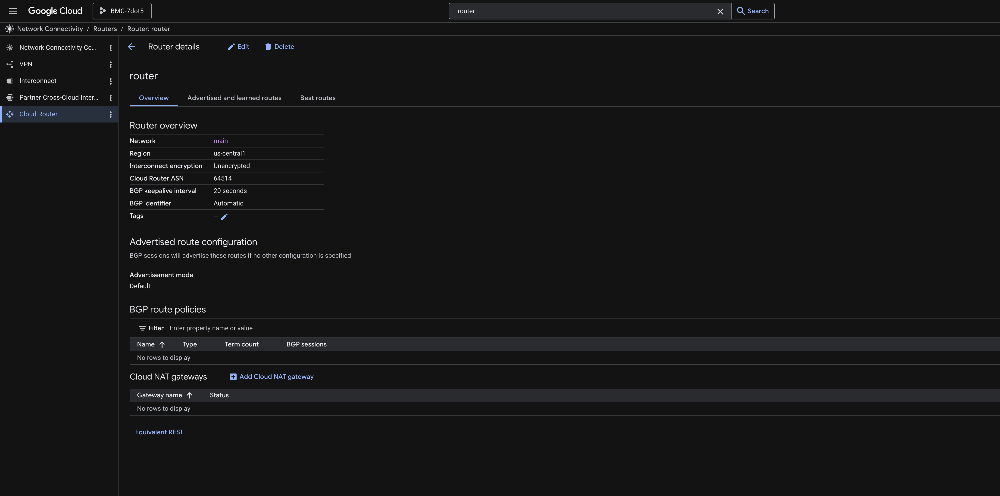
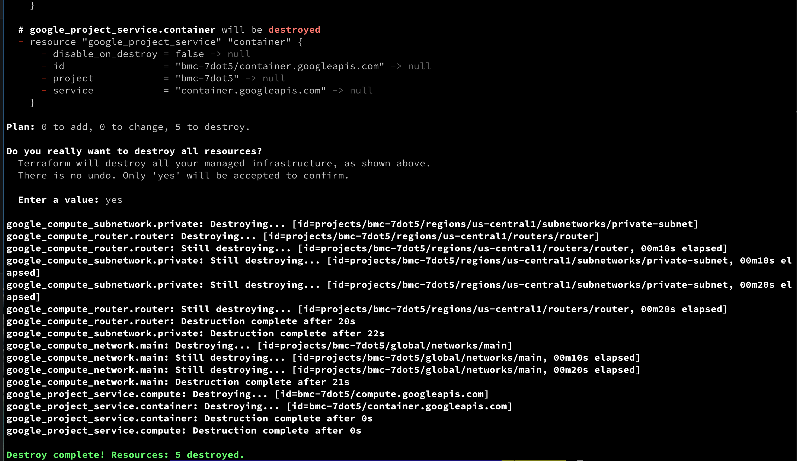
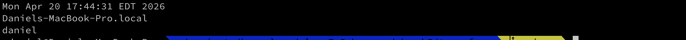
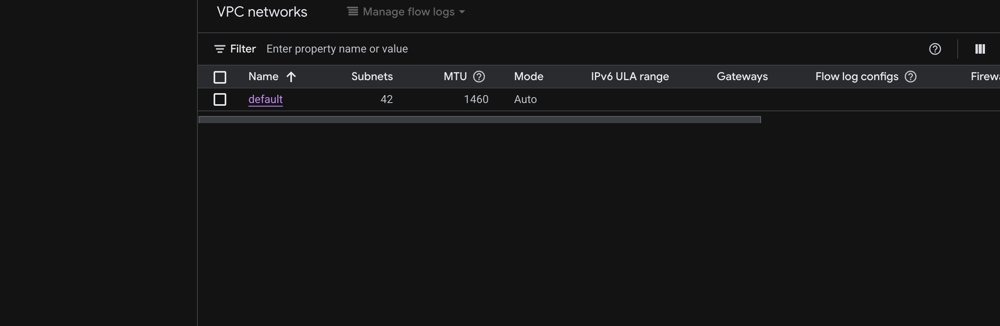

---
tags:
  - BMC
  - GCP
  - homework
name: Homework Week 5
week: "5"
---

# Deliverables

- [x] Terraform Init
      
- [x] Terraform Validate
      
- [x] Terraform Plan
      
- [x] Terraform Plan Output
      
- [x] Terraform Apply
      
- [x] Google Console: Main VPC Exists
      
- [x] Google Console: Subnet Exists
      
- [x] Google Console: Router Exists
      
- [x] Terraform Destroy
      
- [x] date && hostname && whoami
      
- [x] Google Console: Main VPC Destroyed
      

# Homework Walkthrough

1. Create the terraform files (see week5/terraform directory)
2. Execute the terraform commands below

```bash
terraform init
terraform validate
terraform plan
terraform apply
```

3. Go to the [Google Cloud Console](https://console.cloud.google.com/) and verify that the following resources were created:
   - a vpc called main
   - a subnet for the vpc
   - a router
4. Execute the following commands from your terminal

```bash
terraform destroy
date && hostname && whoami
```

5. Manually verify in the [Google Cloud Console](https://console.cloud.google.com/) that your resources have been deleted
6. Go to your backend bucket and find your state file
