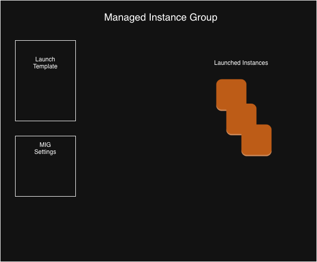
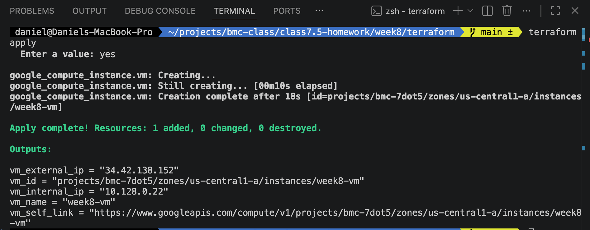
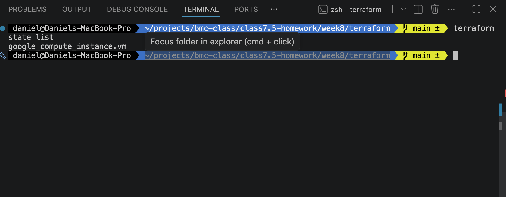
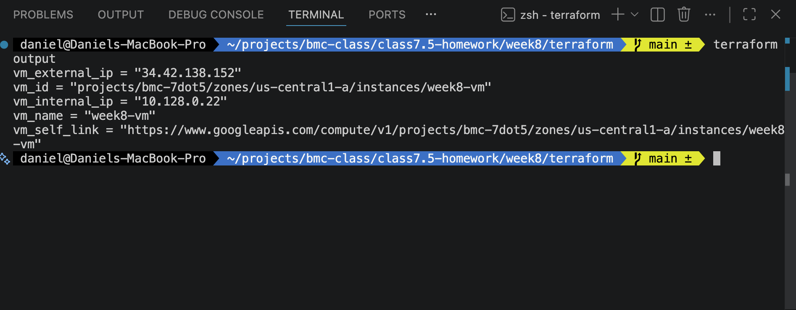

---
tags:
  - BMC
  - GCP
  - homework
  - terraform
  - Managed Instance Groups
name: Homework Week 8
week: "8"
---

# Overview

The goals of this week's project are to document the creation of a working Managed Instance Group using ClickOps and to create a VM using terraform.

# Architecture

# Deliverables -- Basic

- [x] [Q & A](./docs/questions-and-answers.md)
- [x] [Runbook](./docs/runbook.md)
- [x] [Terraform](./docs/terraform.md)
- [x] Terraform Apply
      
- [x] Terraform State
      
- [x] Terraform Output
      

# Documentation

- [Notes](./docs/notes.md#general-notes)
- [Troubleshooting](./docs/notes.md#troubleshooting)
- [Resources](./docs/notes.md#resources)
