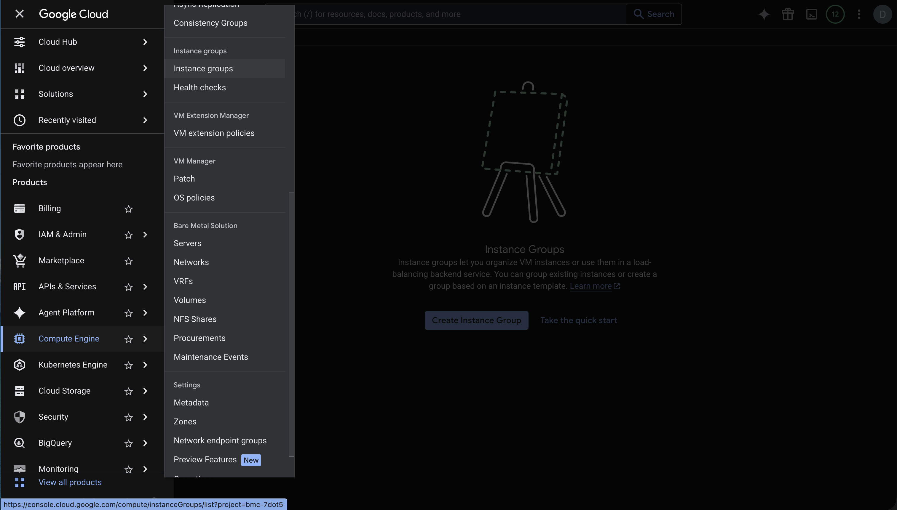
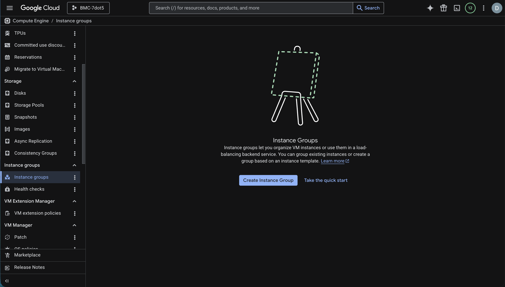
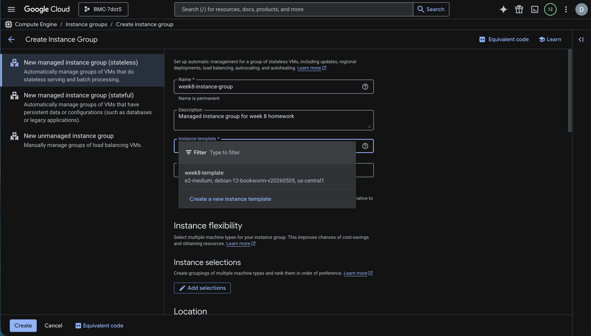
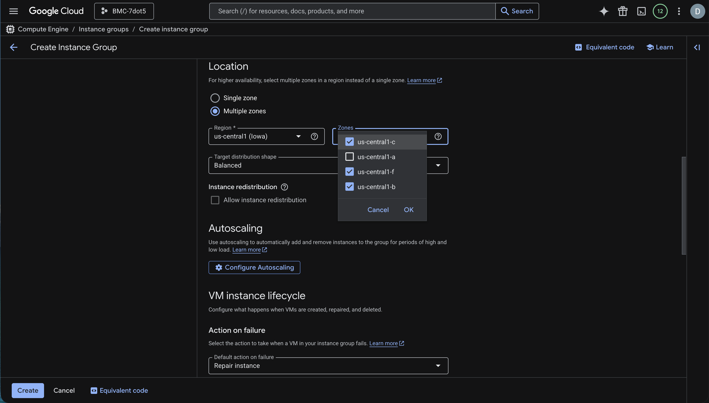
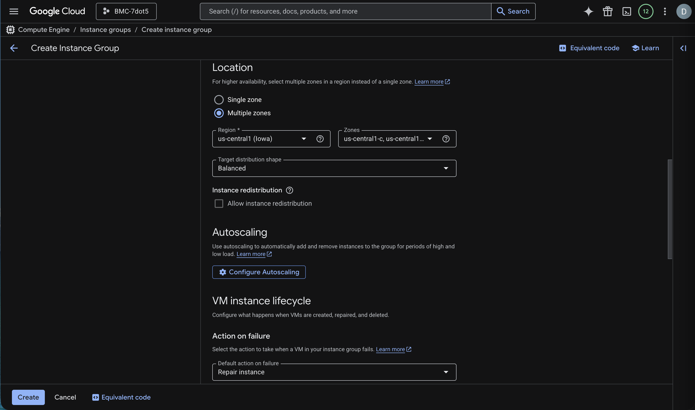
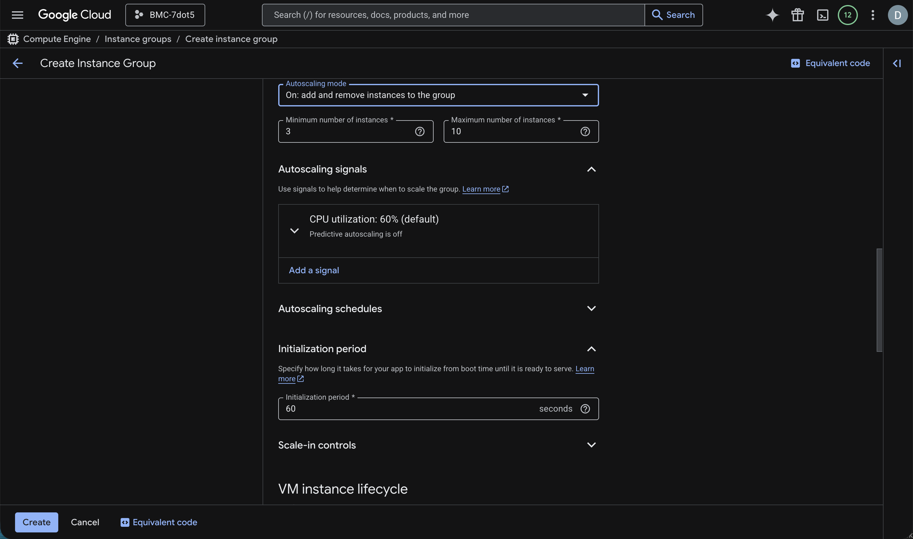
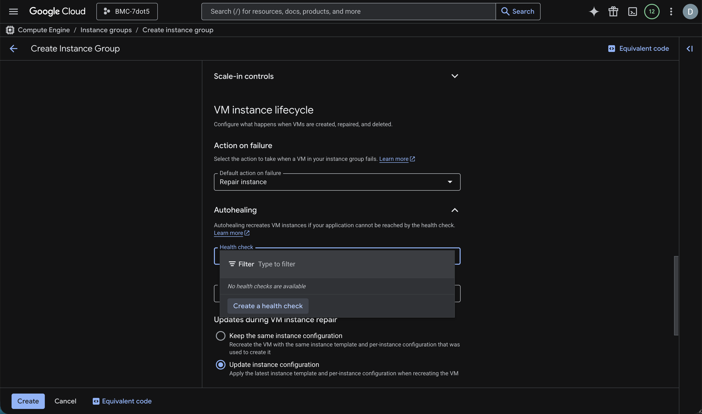
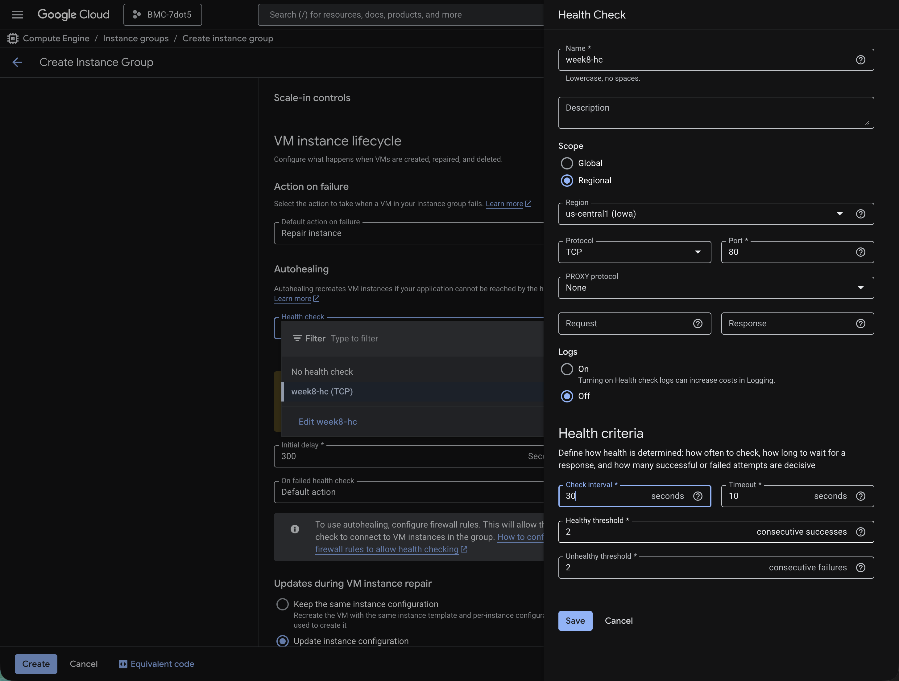
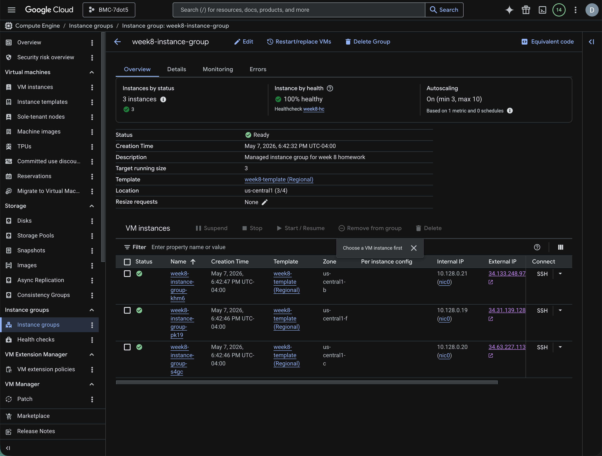

# Creating Managed Instance Group with ClickOps

The result of completing the steps below will be a working `Managed Instance Group`. The managed instance group will make it easier to manage several instances that are all the same / made from the same template. This makes it easier to provide high availability and scale in response to traffic or load changes. The managed instance group will be configured to use autoscaling and autohealing.

_In order to achieve high availability, the instances will be created across zones. This ensures that if there is an issue in one zone, we will still have working instances._

## Architecture

Your Managed Instance Group (MIG) will be made up of a launch template and MIG specific settings (health check, autoscaling options...) and will be used to launch instances based on those settings.

## Prerequisites

1. You need to be able to access the GCP console
1. You need to have a VPC (the default is fine)
1. Firewall rules that allow traffic on HTTP (TCP port 80)
1. You need to create a template that will be the basis of images in the Managed Instance Group
   1. The template should run a webserver and serve an index.html page
1. The compute engine API must be enabled for your user

## Creating the Managed Instance Group

1. Log Into the GCP Console
1. From the hamburger menu select Compute Engine -> Instance Groups
   
1. Click the Create Instance Group button
   
1. Fill in a Name and Description
1. Select your instance template from the list of instance templates
   
1. For the Number of Instances enter at least 3
   _You want at least 3 in order to have your instances spread over at least 3 zones_
1. Under Location, choose Multiple Zones
1. Select a region and check at least 3 zones (if your region has less than 3 then select the max number you can)
   
1. Click the Configure Autoscaling button
   
1. Set the min/max number of zones -- the min number should at least equal the number of zones you selected
   
1. Under the Autohealing section, Click in the Health check box and then click Create a health check using the values in the screenshot below for reference
   
   
1. Leave everything else as default and click the blue Create Button
1. Go to the Managed Instance Group and monitor the status as well as instances
   _It may take 5 or more minutes for your instances to come up and be considered healthy_
   

## Teardown

1. Open your managed group
1. Click Delete Group
1. Go to Health Checks -> Delete the Health Check
1. Go to Templates -> Delete the template (this is optional as you are generally not charged for health checks)

## Notes

- What is autoscaling?
  - increase/decrease the number of resources
- What is autohealing?
  - replace or restart an instance that is considered unhealthy
  - the goal is to get the instance back into a working state or remove it
- How can you verify that your instance group will manage instances across multiple zones?
  - By checking multiple zones for the instances to be created in
