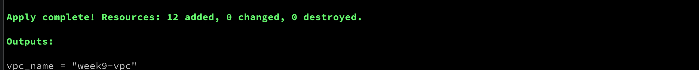
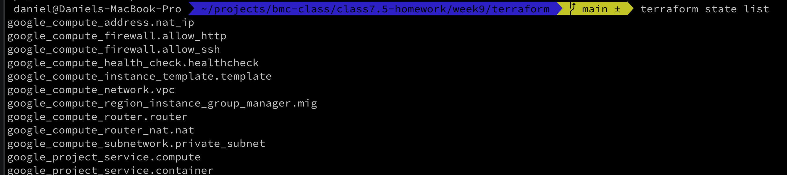

---
tags:
  - BMC
  - GCP
  - homework
  - terraform
  - Load Balancing
name: Homework Week 9
week: "9"
---

# Overview

The goals of this week's project are to document the creation of a working External Load Balancer using ClickOps and to create a custom VPC, firewall rules and Managed Instance Group using terraform.

# Deliverables -- Basic

- [x] [Q & A](./docs/questions-and-answers.md)
- [x] [Runbook](./docs/runbook.md)
- [x] Terraform Apply
      
- [x] Terraform State
      

# Documentation

- [Notes](./docs/notes.md#general-notes)
- [Troubleshooting](./docs/notes.md#troubleshooting)
- [Resources](./docs/notes.md#resources)
